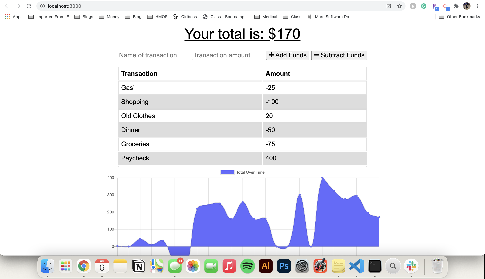

# Budget Tracker

An app designed for users to track transactions and their account balance.

## Table of Contents
* [Installation](#Installation)
* [Usage](#Usage)
* [License](#License)
* [Contributing](#Contributing)
* [Tests](#Tests)
* [Questions](#Questions)

## Installation
npm i

## Usage
Start project using npm start after installing dependencies. Type transaction information in to the tracker and press enter to update your balance.

### Deployed App
https://secret-brushlands-94804.herokuapp.com/

## License
This project is licensed under the MIT license.

## Contributing
No

## Tests
N/A

## Questions
If you have any questions, you can find me on Github under at http://github.com/kayleehorner. Still have questions? You can email me at: kayleeahorner@gmail.com
